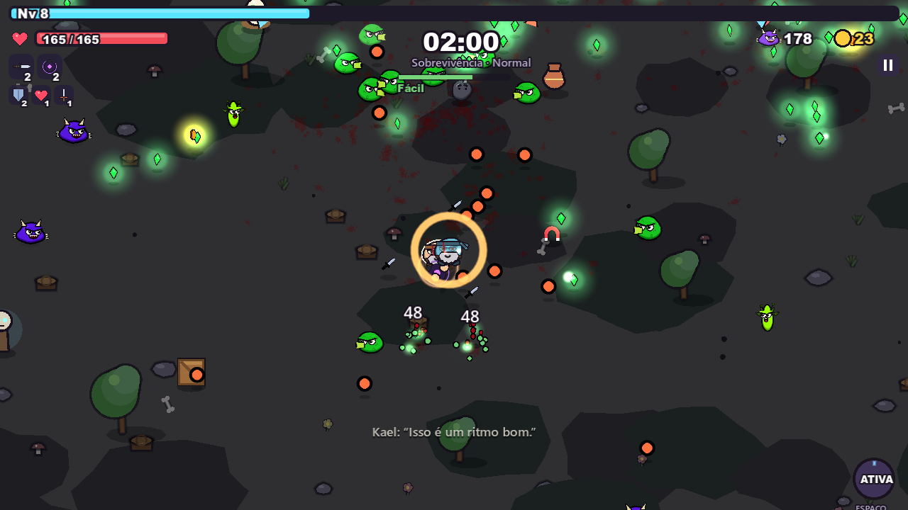

## Sobre mim

Profissional de tecnologia com experiência em **infraestrutura corporativa**, **suporte técnico avançado** e **soluções digitais**. Gosto de automatizar o que é repetitivo, deixar ambientes estáveis e transformar ideias em produtos que as pessoas usam, de scripts de diagnóstico a um jogo completo.

- Hoje: desenvolvendo o **Horda Infinita**, um roguelite de sobrevivência em Godot.
- Também: aplicações internas com Azure, Microsoft 365 e IA (Azure OpenAI e Claude).
- Interesses: automação, Microsoft 365 e Azure, Linux, monitoramento e desenvolvimento de jogos.

## Projetos em destaque

> 🧪 **[Vitrine com demos que rodam no navegador → srlorenzos.netlify.app](https://srlorenzos.netlify.app)**

<table>
<tr>
<td width="50%" valign="top">

### 🎮 Horda Infinita
Roguelite de sobrevivência contra hordas: 13 heróis, 12 armas com evolução, chefes, 5 biomas e mapa para explorar.

[**Jogar no navegador**](https://horda-infinita.netlify.app) · [Comunidade](https://github.com/srlorenzos/horda-infinita)

</td>
<td width="50%" valign="top">

</td>
</tr>
</table>

| Projeto | O que é |
| --- | --- |
| [**quorum-trader**](https://quorum-trader.netlify.app) | Robô de trade para Windows em **Python**: agentes que votam e aprendem de hora em hora, notícias via RSS, MetaTrader 5 (XP) e Binance, backtest e travas de risco. Produto com licença Ed25519 e site de vendas com Netlify Functions. [Demo](https://srlorenzos.netlify.app/demos/quorum-trader/) |
| [**farol-rmm**](https://github.com/srlorenzos/farol-rmm) | RMM próprio: painel web, agente Python para Windows/Linux, scripts remotos com confirmação 2FA, alertas e auditoria. [Demo](https://srlorenzos.netlify.app/demos/farol-rmm/) |
| [**resumo-do-dia**](https://github.com/srlorenzos/resumo-do-dia) | E-mail toda manhã com agenda do Google, tarefas do TickTick e contas do Organizze, via GitHub Actions. [Demo](https://srlorenzos.netlify.app/demos/resumo-do-dia/) |
| [**email-para-tarefa**](https://github.com/srlorenzos/email-para-tarefa) | Cloudflare Email Worker: encaminhe um e-mail e ele vira tarefa no TickTick, com `#tag !alta @sexta` no assunto. [Demo](https://srlorenzos.netlify.app/demos/email-para-tarefa/) |
| [**painel-organizze**](https://github.com/srlorenzos/painel-organizze) | Painel financeiro para o Organizze com gráficos SVG interativos e zero dependências. [Demo](https://srlorenzos.netlify.app/demos/painel-organizze/) |
| [**mcp-pessoal**](https://github.com/srlorenzos/mcp-pessoal) | Servidor MCP que dá ao Claude acesso à agenda, tarefas e finanças. [Demo](https://srlorenzos.netlify.app/demos/mcp-pessoal/) |
| [**palavreco**](https://github.com/srlorenzos/palavreco) | Jogo de palavras estilo Termo em **Python**/tkinter. [Jogar](https://srlorenzos.netlify.app/demos/palavreco/) |
| [**gtd-terminal**](https://github.com/srlorenzos/gtd-terminal) | O método GTD no terminal, em **Java 17**, no formato todo.txt. [Demo](https://srlorenzos.netlify.app/demos/gtd-terminal/) |
| [**Hub de Consultoria**](https://github.com/srlorenzos/hub-consultoria-showcase) | Portal interno de consultoria Microsoft 365: documentos gerados com IA a partir de prints, kanban sincronizado com SharePoint e dashboard. *Vitrine com dados fictícios.* |
| [**Design system como skill do Claude**](https://github.com/srlorenzos/design-system-claude-showcase) | Identidade, componentes, UX e segurança por padrão para as aplicações internas, aplicados automaticamente pela IA. *Vitrine com dados fictícios.* |
| [**valida-br**](https://github.com/srlorenzos/valida-br) | Valida e formata CPF, CNPJ (inclusive o **alfanumérico de 2026**), CEP e telefone. Zero dependências, testado no Node 18/20/22. |
| [**infra-toolkit**](https://github.com/srlorenzos/infra-toolkit) | Relatório de saúde do Windows em HTML e diagnóstico de rede em etapas para Windows e Linux. |
| [**status-sentinela**](https://github.com/srlorenzos/status-sentinela) | Monitor de disponibilidade grátis e sem servidor: GitHub Actions + [página de status](https://srlorenzos.github.io/status-sentinela/). |

## Ferramentas

## Atividade

